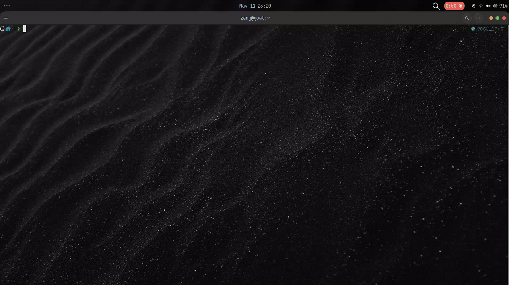
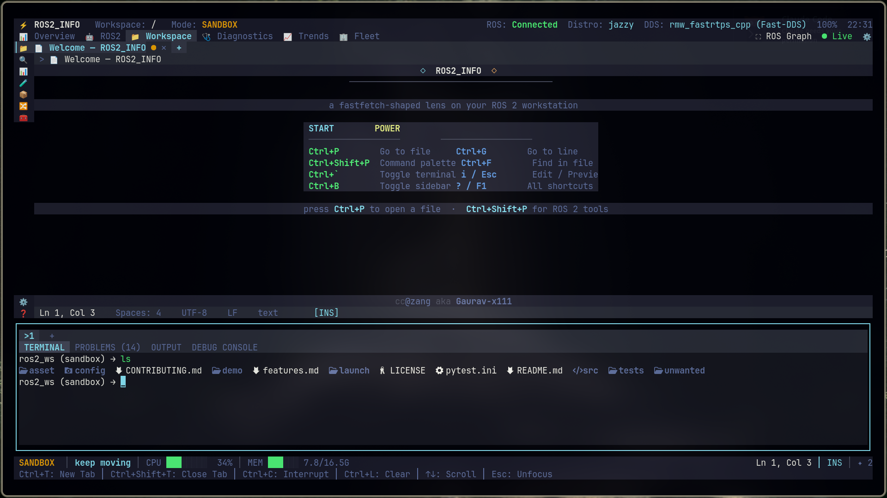
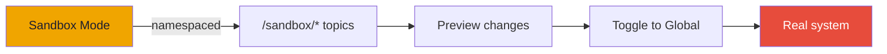
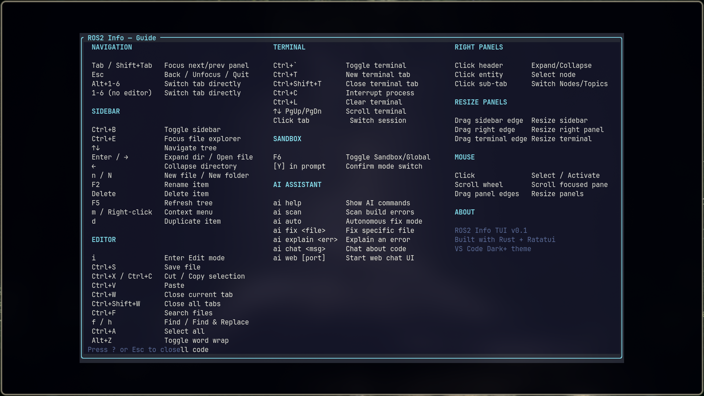

<div align="center">

# ROS2 Info ⊙
A fastfetch-style ROS2 workstation lens: **know what, where, and which is working**.



<div align="center">

**Born from curiosity. Built for roboticists.**

A Rust terminal IDE for ROS 2 developers — VS Code energy, zero Electron weight.

[](LICENSE)
[](https://www.rust-lang.org)
[](https://docs.ros.org)
[]()
[](CONTRIBUTING.md)
[](https://github.com/Gaurav-x111/ros2_info)
[](https://github.com/developer/register)

> **GitHub Developer Program member** — `ros2_info` integrates with the GitHub REST API. Uses the Invertocat mark to show integration, per [GitHub's logo guidelines](https://github.com/logos).

</div>

---

## See it move

> A real TUI, not a static screenshot. Produced with the tool's own session recorder — the tool demos itself.


<table>
 <tr>
   <td><image src="asset/go_to_file.png" width ="500" alt=" GO TO FILE"></td>
   <td><image src="asset/action_newfile_delete.png" width ="500" alt="ACTION"></td>
 </tr>
</table>

---

## 30-second quickstart

**Install:**

```bash
# Clone and build (one-time, ~30s on a modern laptop)
git clone https://github.com/Gaurav-x111/ros2_info && cd ros2_info
cd src/tui && cargo build --release && cd ../..

# Run
./src/tui/target/release/ros2-info-tui
```

**That's it.** No Python venv. No `pip install`. No dependency chain. One binary, runs on whatever you built it on.

The Python collector is called in the background for ROS 2 data — if you have Python 3.10+ and a sourced ROS 2 workspace, it Just Works. If not, you still get the full editor, terminal, system stats, and file explorer.

---

## Feature highlights

- **Full-screen VS Code-style TUI** — Explorer, tabbed editor with syntax highlighting, integrated pty-backed terminal, right panel with entities/telemetry/graph
- **Six live dashboard tabs** — Overview, ROS 2, Workspace, Diagnostics, Trends, Fleet — backed by a background collector thread
- **Real PTY terminal** — run `ros2` commands, `colcon build`, `ros2 launch` — not a one-shot `Command::output()` shim
- **Multi-tab editor** — open files from the explorer, undo/redo, find/replace, word wrap, goto-line, change indicators, Neovim keybindings
- **Mouse + keyboard, both first-class** — click tabs, drag panel edges, scroll editor/terminal, right-click context menus — not one as a fallback for the other
- **ROS 2 Graph canvas** — live publisher → topic → subscriber visualization with drawn connections
- **AI assistant** — `ai scan`, `ai fix`, `ai explain`, `ai chat` inside the terminal (Ollama backend, diff-gated)
- **Sandbox / Global toggle** — try things in a namespaced sandbox before touching the real system
- **Git integration** — status, diff, commit, branches, GitHub issues/PRs via `gh`
- **Command Palette** — fuzzy file open (`Ctrl+P`), ROS 2 tool launcher (`Ctrl+Shift+P`)
- **Plugin system** — in-process Rust plugin API: add dashboard tabs, terminal commands, and lifecycle hooks without forking the core
- **Cross-container visibility** — `ros2_info compose` aggregates nodes/topics across all running Docker containers (incl. docker-compose stacks on isolated networks/domains) via `docker exec`, so the dashboard shows the whole system, not just one DDS domain
- **Single static binary** — built for Raspberry Pi / Jetson / SSH, not just laptops

---

## Why this exists

| Task | Raw `ros2` CLI + editor | `ros2_info` |
|---|---|---|
| See what's running | `ros2 node list` + `ros2 topic list` + `ros2 service list` (three terminals) | One dashboard, live-updating |
| Figure out which DDS | `echo $RMW_IMPLEMENTATION` + guess | Title bar, always visible |
| Check workspace health | `colcon build --packages-select ...` + read output | Diagnostics tab, auto-detected |
| Edit a file | Switch to VS Code, find it, open it | Explorer sidebar, multi-tab editor, right here |
| Run a launch file | `ros2 launch pkg file.py` in a separate terminal | Integrated terminal, no context switch |
| Debug a transform tree | `ros2 run tf2_tools view_frames` + open PDF | ROS 2 Graph canvas, live |
| Try something safely | Hope you don't break the robot | Sandbox mode, namespaced |

The honest case: **it's not that you can't do these things manually. It's that doing them in one screen is better than doing them in five.**

---

## Sandbox vs. Global



**Sandbox** (default): Commands run in a `/sandbox` namespace. Nodes, topics, and services are isolated from the real system. Try things freely.

**Global**: Commands execute directly on your real ROS 2 environment. Toggle with `F6` — you'll get a confirmation prompt first.

> The full Preview → Apply export flow (staging changes before committing to Global) is on the roadmap. Today it's a binary toggle.

---

## Plugins

`ros2_info` ships with an **in-process Rust plugin API** — you can extend the TUI (add dashboard tabs, register terminal/AI commands, react to lifecycle events) without forking the core crate. A built-in **example plugin** is registered by default so you can see it working immediately.

### What you get out of the box

- **Plugins sidebar** (click the 🔌 activity bar icon) — lists every registered plugin with its version, and renders the first contributed dashboard tab live.
- **`ai battery`** — a terminal command contributed by the example plugin that reads `/sys/class/power_supply/BAT0/capacity`.
- **File-saved notifications** — the example plugin reacts to `AppEvent::FileSaved` and shows a status toast on every save.

### How to add a plugin

The full walkthrough lives in **[`docs/plugins.md`](docs/plugins.md)**. The short version:

1. Create a crate under `src/tui/src/plugins/<name>/` (or add a module to `src/tui/src/plugins/`).
2. Implement `ros2_info_tui::plugin::Plugin` — provide `name()`, `version()`, and any of `dashboard_tabs()`, `terminal_commands()`, `on_event()`.
3. Register it in `src/tui/src/plugins/mod.rs::register_builtins` (one line: `mgr.register(Box::new(my_plugin::MyPlugin));`).
4. `cargo build` — your plugin is live. No FFI, no external loader.

```rust
use ros2_info_tui::plugin::{Plugin, AppEvent, PluginAction};

pub struct MyPlugin;

impl Plugin for MyPlugin {
    fn name(&self) -> &str { "my-dashboard" }
    fn version(&self) -> &str { "0.1.0" }

    fn on_event(&self, event: &AppEvent) -> Option<PluginAction> {
        match event {
            AppEvent::FileSaved(path) =>
                Some(PluginAction::Notify(format!("saved {}", path.display()))),
            _ => None,
        }
    }
}
```

### What plugins can / can't do

- **Can:** add dashboard tabs, register `ai <command>` handlers, react to `BuildFailed` / `FileSaved` / `GitPush` / `TopicReceived` events, surface notifications and enqueue terminal commands.
- **Can't:** mutate editor content without consent, reach the network without permission, bypass the Preview → Apply gate, or read another plugin's state.

> External / third-party plugins (loaded at runtime) are the next step. Today plugins are compiled into the binary via `register_builtins`; the API surface they implement is stable and documented in `docs/plugins.md`.

---

<details>
<summary><strong>Full command reference</strong></summary>

### TUI keyboard shortcuts



### Mouse interactions

| Action | Target |
|---|---|
| Click | Tabs, activity bar icons, explorer tree rows, editor cursor placement |
| Right-click | File tree context menu (rename, delete, duplicate) |
| Scroll | Editor content, terminal scrollback |
| Drag | Panel resize edges (sidebar, right panel, terminal top) |
| Click `+` | New editor tab |
| Click `✕` | Close editor tab |

### AI commands (in terminal)

| Command | What it does |
|---|---|
| `ai help` | List available commands |
| `ai` | Enter interactive chat mode |
| `ai scan` | Hunt build errors in your workspace |
| `ai fix <file>` | Attempt to patch a specific file |
| `ai auto` | Scan + fix (up to 3 attempts, diff-gated) |
| `ai explain <error>` | Translate compiler output to English |
| `ai chat <msg>` | Ask a question |
| `ai web [port]` | Web chat UI (default 8899) |

> Mutating actions (`ai fix`, `ai auto`) go through the same Preview → Apply gate as everything else. No silent exceptions.

</details>

<details>
<summary><strong>Full keybinding table (Neovim mode)</strong></summary>

| Key | Action |
|---|---|
| `i` | Enter Insert mode |
| `a` | Append after cursor |
| `o` | Open line below |
| `A` | Append to end of line |
| `I` | Insert at start of line |
| `dd` | Delete line |
| `yy` | Yank (copy) line |
| `p` | Paste below |
| `u` | Undo |
| `Ctrl+R` | Redo |
| `v` | Enter visual mode |
| `gg` | Go to top |
| `G` | Go to bottom |
| `w` / `b` / `e` | Word forward / back / end |
| `0` / `$` | Start / end of line |

</details>

---

## Supported platforms

| Platform | Status |
|---|---|
| **Linux x86_64** | Primary development platform |
| **Linux aarch64** | Built and tested on Raspberry Pi 5, Jetson Orin |
| **SSH sessions** | First-class — the TUI is designed for headless-over-SSH workflows |
| **macOS** | Should work (ratatui + crossterm), not primary testing target |
| **Windows** | Not yet — `portable-pty` has Windows support but untested |

The binary ships statically linked. No Python venv required for the TUI itself. The Python collector (`ros2_fastfetch`) is called in the background for ROS 2 data and needs Python 3.10+ with a sourced ROS 2 workspace — but the TUI runs without it (you just don't get ROS 2 entity discovery).

---

## Roadmap

- [x] Full-screen VS Code-style TUI
- [x] Six dashboard tabs with live background collection
- [x] Integrated pty-backed terminal with multiple sessions
- [x] Multi-tab editor with syntax highlighting, undo/redo, find/replace
- [x] Mouse support: click, scroll, drag-resize, right-click context menu
- [x] ROS 2 Graph canvas (publisher → topic → subscriber)
- [x] Git integration with GitHub issues/PRs
- [x] Command Palette with fuzzy file open
- [x] Neovim keybinding mode
- [x] AI assistant (Ollama-backed, diff-gated)
- [x] Sandbox / Global mode toggle
- [x] Plugin system (in-process Rust API + built-in example plugin)
- [ ] Session recorder (`.cast` / GIF export)
- [ ] Additional themes (Nord, Tokyo Night, Gruvbox, Dracula, Catppuccin)
- [ ] Multi-file AI refactors + test generation

---

## Contributing

Contributions welcome. See [CONTRIBUTING.md](CONTRIBUTING.md) for setup instructions and guidelines.

The short version: fork, branch, `cargo build`, make it work, make it clean, open a PR.

---

## Credits

**cc@zang aka Gaurav-x111** — author and maintainer.

Built with [Ratatui](https://ratatui.rs), [Crossterm](https://github.com/crossterm-rs/crossterm), and stubbornness.

Started from a Python fastfetch-style tool with 39 stars before this Rust rewrite.

---

## GitHub integration

`ros2_info` is a participant in the **GitHub Developer Program** — it integrates
directly with the [GitHub REST API](https://docs.github.com/en/rest) to surface
issues and pull requests for the repository you're working in, and to create
issues from the TUI.

- Issues and PRs are fetched from `api.github.com` and rendered in the Git
  sidebar's **Issues** / **Pull Requests** tabs.
- Authenticated requests are used automatically when a token is present
  (higher rate limits, private repos):

  ```bash
  export GITHUB_TOKEN=ghp_your_token_here
  ```

- If the API is unreachable or no token is set, the tool gracefully falls back
  to the [`gh` CLI](https://cli.github.com) when it's installed.

**Support contact:** open an issue at
[github.com/Gaurav-x111/ros2_info/issues](https://github.com/Gaurav-x111/ros2_info/issues)
or email **gauravshah0777@gmail.com**.

---

## License

[MIT](LICENSE)

## Future updates (coming soon)
<div align="center">

*Created by roboticists, for roboticists* 🤖

**[⭐ Star on GitHub](https://github.com/Gaurav-x111/ros2_info)** · **[🐛 Report an issue](https://github.com/Gaurav-x111/ros2_info/issues)** · **[🍴 Fork it](https://github.com/Gaurav-x111/ros2_info/fork)**

</div>
