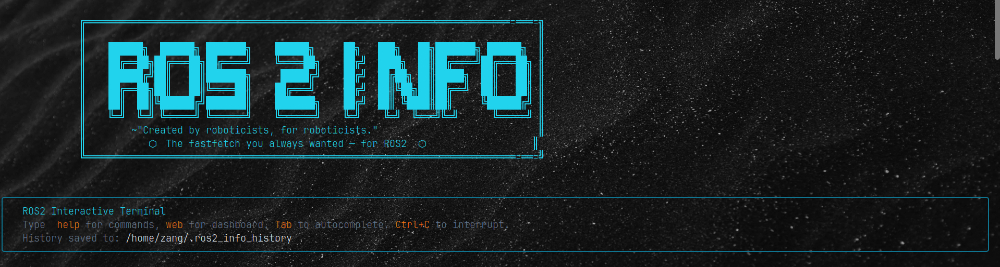
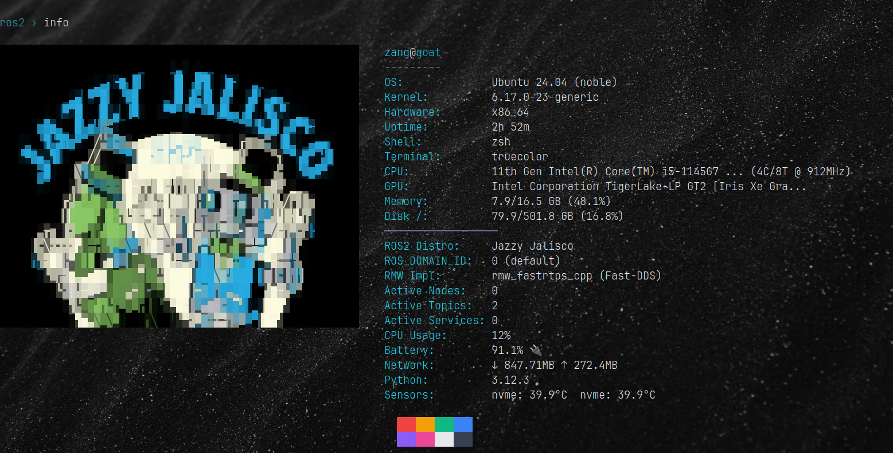

# ROS2 Info ⊙
A fastfetch-style ROS2 workstation lens: **know what, where, and which is working**.


<div align="center">

[](https://docs.ros.org)
[](https://python.org)
[](LICENSE)
[](https://colcon.readthedocs.io)
[](https://github.com/Gaurav-x111/ros2_info/releases)

*Born from curiosity. Built for roboticists.*

</div>

## Why this was made
**Short answer:** this was made to know **what**, **where**, and **which** is working.

**Fun answer:** I wanted to know how a fastfetch for ROS2 would look, kept working on it, and turned it into a true ROS2 workspace tool.<!--  -->

**Joke:** If `ros2 node list` is empty, did the robots take a coffee break or did we forget to source again? ☕🤖

## 🆕 What's new in v2.0.0
 
| Feature | What it does |
|---|---|
| 🌡️ **Hardware Sensor Telemetry** | Real-time CPU, Memory, Battery + hardware temps in the terminal fastfetch and web dashboard |
| 🖥️ **Interactive Terminal REPL** | Full shell-like REPL with discovery, monitoring, actions, and tmux helpers — all in one place |
| 🌐 **Web Dashboard v2** | Full interactive dashboard with a built-in terminal and a pure-JS RQT-like node/topic graph |
| 🕸️ **RQT-like ASCII Graph** | View your pub→sub topology right in the terminal with `graph` |
| 🎨 **Distro-aware ASCII art** | Auto-renders high-quality distro logos with image fallback support |
| 🏗️ **Workspace auto-detection** | Always know which overlays are active and which build you're running |
 
---
 
## 🗂️ Workspace Intelligence — Know Your Environment
 
> *"The robots didn't fail. The sourcing did."*
 
ROS2 development isn't just about writing nodes — it's about surviving the environment.
**ROS2 Info** gives you an instant, accurate snapshot of your entire workspace state the moment you need it.


### 🔍 What gets surfaced — instantly
 
```
╔══════════════════════════════════════════════════════════════════╗
║  WORKSPACE SNAPSHOT                         ros2_info v2.0.0    ║
╠══════════════════════════════════════════════════════════════════╣
║  📦 Distro          ROS2 Jazzy Jalisco                          ║
║  🔧 DDS Middleware  rmw_fastrtps_cpp                            ║
║  🌐 Domain ID       ROS_DOMAIN_ID = 42                          ║
║  🏗️  Workspaces     /opt/ros/jazzy          [system]  ✔ sourced ║
║                     ~/ros2_ws               [overlay] ✔ sourced ║
║                     ~/robot_bringup_ws      [overlay] ✔ sourced ║
║  🔨 Build Status    ros2_ws        → ✔ up to date               ║
║                     robot_bringup  → ⚠  stale (needs rebuild)  ║
║  🌡️  Hardware       CPU 34°C  ▓▓▓▓░░░░  42%  |  RAM 6.1/16GB   ║
║  🧩 Active Nodes    12 nodes alive                              ║
║  📡 Topics          38 topics publishing                        ║
╚══════════════════════════════════════════════════════════════════╝
```
 
### 📊 Full breakdown
 
| Field | What it shows | Why you need it |
|---|---|---|
| 📦 **Distro** | Jazzy / Humble / Iron / Rolling | No more `printenv ROS_DISTRO` every session |
| 🔧 **DDS Middleware** | rmw implementation in use | Spot cross-DDS communication failures instantly |
| 🌐 **Domain ID** | `ROS_DOMAIN_ID` value | Catch domain mismatches before they waste an hour |
| 🏗️ **Workspaces** | All sourced overlays + paths | Know your full source chain at a glance |
| 🔨 **Build Status** | Fresh / stale / never built | No more running stale code from a forgotten build |
| 🌡️ **Hardware** | CPU temp, usage, RAM, battery | System health at a glance during bringup |
| 🧩 **Active Nodes** | Live node count | See what's alive the moment you open the terminal |
| 📡 **Topics** | Publishing topic count | Instant pulse check on your runtime |
| 🌍 **Env Variables** | Full `ROS_*` dump | Every env variable, one clean view |
 
---
 
### 😤 The sourcing problem — and why it hurts so much
 
Every ROS2 developer knows this exact sequence of suffering:
 
```
🖥️  Terminal A  →  source /opt/ros/jazzy/setup.bash
                →  ros2 run bridge bridge_node
                →  ✔ running
 
🖥️  Terminal B  →  source /opt/ros/humble/setup.bash
                →  ros2 topic list
                →  ✔ topics visible... wait, why is nothing talking?
 
🖥️  Terminal C  →  ros2 node list
                →  (empty)
                →  💀 wasn't sourced at all
 
🖥️  Terminal D  →  echo $ROS_DOMAIN_ID
                →  (blank)
                →  Terminal A is on domain 0. Terminal B is on domain 42.
                →  🤯 INTERNAL KERNEL PANIC
```
 
You just lost 45 minutes to environment, not code.
 
### ✅ After ROS2 Info — the new workflow
 
```
$ ros2_info
 
  ✔ Distro      → Jazzy
  ✔ Domain ID   → 42 (matches across all terminals)
  ✔ Workspaces  → 3 sourced, 3 up to date
  ✔ Nodes       → 12 alive
  ✔ Topics      → 38 publishing
  ✔ CPU         → 34°C  42%  |  RAM 6.1 / 16 GB
 
  Everything looks good. Go build robots. 🤖
```
 
**One command. Full picture. Zero surprises.**
 
---
 
## 🖥️ Features & Interactive Terminal
 
Enter the full REPL with:
```bash
ros2_info (**this will appear**)
``
## Features
```
    ╔═══════════════════════════════════════════════════════════════════════════╗
    ║                     ROS2 Info — Interactive Terminal v2.0.0               ║
    ╚═══════════════════════════════════════════════════════════════════════════╝

       DISCOVERY
                info                  System and ROS2 fastfetch overview
                nodes                 List active nodes
                topics                List active topics
                services              List active services
                actions               List active actions
                env                   Show ROS2 environment variables
                node info <name>      Show node publishers/subscribers/services
                interface show <t>    Show message/service/action definition

        MONITORING
                echo <topic> [--once]   Stream topic messages
                hz <topic>              Publish rate
                bw <topic>              Bandwidth
                watch [interval]        Live node refresh (2s)
                ping <node>             Liveness check
                graph [timeout]         ASCII pub→sub graph
                rqt                     Launch rqt_graph GUI (bg)

        ACTIONS
                pub <topic> <type> <yaml> [--once]
                service call <srv> <type> [<yaml>]
                param list [/node]
                param get <node> <param>
                param set <node> <param> <value>
                bag record [-a | topics...]
                bag play <file>
                bag info <file>
                launch <pkg> <file> [key:=val ...]
                run <pkg> <exe> [args...]
                colcon build [--packages-select pkg]
                colcon test

        TMUX
                tmux new [name]     New session
                tmux list           List sessions
                tmux attach [name]  Attach session
                tmux kill <name>    Kill session
                tmux split          Horizontal split
                tmux vsplit         Vertical split
                web [port]          Launch web dashboard (bg)

        SYSTEM
                cd <path>           Change directory
                ls [path]           List files
                pwd                 Print working directory
                shell <cmd>         Run any shell command
                source <file>       Source bash file → env
                history             Show command history
                help                Show this help
                clear               Clear screen
                quit / exit / q     Exit terminal
```

## Importance
- Stops the “where am I sourced?” guessing game.
- Shows live ROS2 health (nodes/topics/services/actions) in one view.
- Gives a fast, clean picture of workspace + system state during bring-up.

## How it works (visuals from assets)
All images and videos live in the asset folder and are used directly in this README.




## 🌐 Web Dashboard — monitor from anywhere
 
```bash
ros2_info web
# → Dashboard live at http://localhost:8099
```
 
Open it on your **phone during hardware integration**. See live workspace state, node health, topic activity, and the interactive RQT-like graph — from anywhere on your network. No SSH. No extra setup.
 
```
http://your-robot-ip:8099
        ↓
┌──────────────────────────────────────┐
│  ROS2 Info  Dashboard       🟢 Live  │
│──────────────────────────────────────│
│  Nodes      12  ●●●●●●●●●●●●         │
│  Topics     38  publishing           │
│  Domain ID  42                       │
│  Distro     Jazzy  ✔                 │
│  Workspaces 3 sourced  ✔             │
│  CPU        34°C  42%                │
│  RAM        6.1 / 16 GB              │
└──────────────────────────────────────┘
```
## Install (all packages)
```bash
# Create and activate a venv (optional but recommended)
python -m venv .venv
source .venv/bin/activate
source /opt/ros/jazzy/setup.zsh     
# Install the project
pip install -e src/ros2_fastfetch
```

## Run
*(Ensure you have sourced your ROS2 environment first: `source /opt/ros/jazzy/setup.bash`)*

```bash
ros2_info 
 **you will enter a workspace **
**OR just follow **
ros2_info
ros2_info terminal
ros2_info web
```

## Future updates (coming soon)
<div align="center">
*Created by roboticists, for roboticists* 🤖
 
**[⭐ Star on GitHub](https://github.com/Gaurav-x111/ros2_info)** · **[🐛 Report an issue](https://github.com/Gaurav-x111/ros2_info/issues)** · **[🍴 Fork it](https://github.com/Gaurav-x111/ros2_info/fork)**
 
</div>

